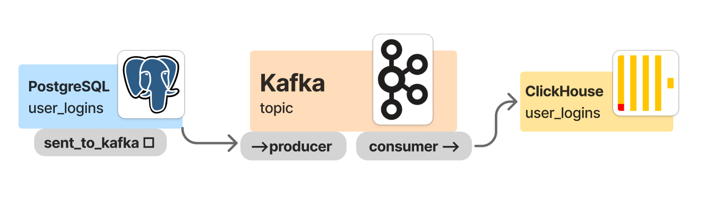
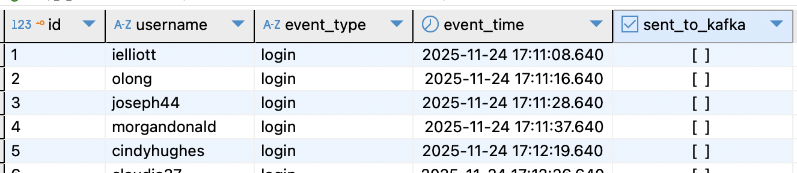
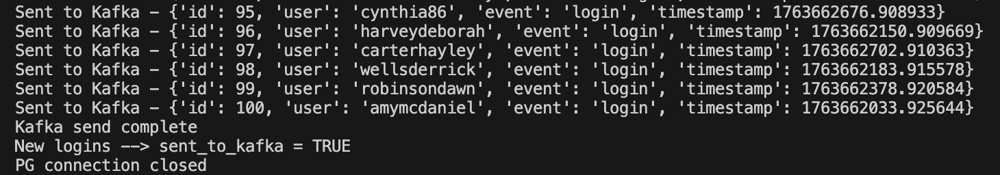
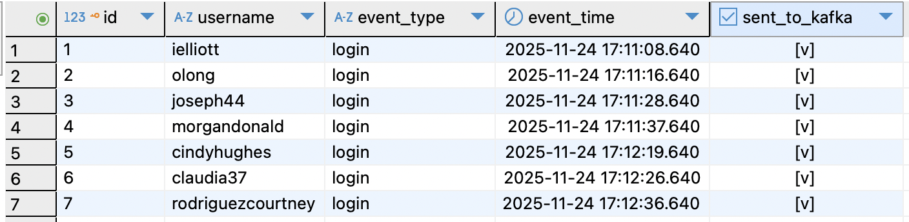
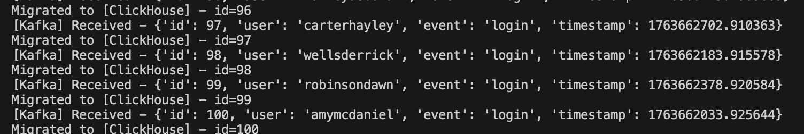
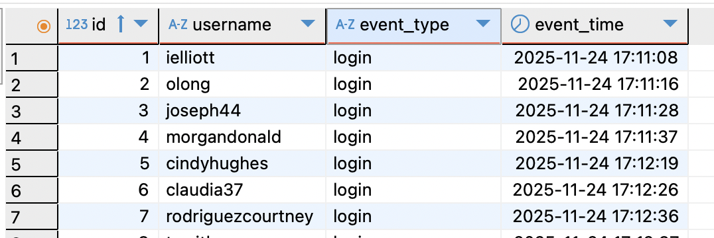

# THE PIPELINE



This project demonstrates a reliable pipeline for transferring events from **PostgreSQL to Kafka** with built-in deduplication logic

The solution eliminates the risk of sending the same database row to Kafka more than once by using a logical flag (`sent_to_kafka`) stored in **PostgreSQL**

### Project Structure
```
kafka-deduplication-service/
│
├── kafka/
│   ├── producer.py
│   └── consumer.py
├── synt_data/
│   └── synt_data.py
├── pic/
│   └── *.png
├── docker-compose.yml
├──README.md
└──requirements.txt

```

# 👶 INSTALLATION

1) Clone the repository:
```
git clone https://github.com/yanashcherbakova/kafka-deduplication-service.git 
cd kafka-deduplication-service 
```
2) Install dependencies: `pip install -r requirements.txt`
3) Create a .env file in the project root:
```
POSTGRES_USER=
POSTGRES_PASSWORD=
CLICKHOUSE_USER=
CLICKHOUSE_PASSWORD=
```
4) Start all services:
`docker-compose up -d`
5) Load synthetic data into PostgreSQL (*Run this step only if your PostgreSQL database is empty*)
```
python synt_data/synt_data.py
```

This script generates: 
- 50 fake usernames
- 100 login events (timestamps, event_type, username)
- Inserts them into user_logins table in PostgreSQL
- Leaves sent_to_kafka = FALSE for new rows


# 👶🍼 HOW TO USE

### Kafka Producer (PostgreSQL → Kafka)

```
python kafka/producer.py
```

- creates connection to PG database
- does select from table `user_logins`
- updates the flag only for rows successfully sent to Kafka (**sent_to_kafka = TRUE**)

- this flag helps to avoid duplication in the future
- sends rows to producer (topic `user_events`)


### Kafka Consumer (Kafka → ClickHouse)
```
python kafka/consumer.py
```
- consumes messages from `user_events`
- writes data to a ClickHouse table



The table uses **ReplacingMergeTree** to safely handle duplicates

```
ENGINE = ReplacingMergeTree()
ORDER BY id
```
This engine merges rows with the same id, keeping only the latest version.
It ensures the final dataset in ClickHouse remains clean even if Kafka sends repeated messages.
## WHATS NEXT?
During the subsequent run of `python synt_data/synt_data.py`, we will see the following in the database.
The Kafka producer will interact only with the new records


# 🗄️ Note about server-side (not used in this project)  

In large production systems, a Kafka producer may process millions of database records.
Loading all rows into memory at once ---> `fetchall()` <--- is not safe in such cases --> the memory footprint becomes unpredictable.

A common production-grade solution is to use a server-side cursor in PostgreSQL:
```
cursor = conn.cursor(name="stream_cursor")
cursor.itersize = 1000
cursor.execute("""
    SELECT id, username, event_type, event_time
    FROM user_logins
    WHERE sent_to_kafka = FALSE
""")

for row in cursor:
    ...
```
A server-side cursor streams rows from PostgreSQL in controlled chunks instead of returning the entire result set to the client.
This keeps RAM usage stable and allows the producer to handle arbitrarily large datasets.